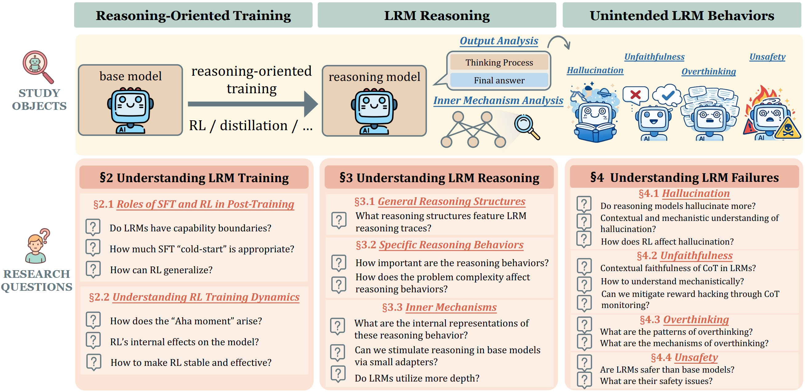

<div align="center">
    
    
# Towards a Mechanistic Understanding of Large Reasoning Models: A Survey of Training, Inference, and Failures

[](https://github.com/sindresorhus/awesome) [](https://github.com/AheadOFpotato/Awesome-LRM-Mechanisms) 
[](LRM_Mechanism_Survey.pdf)

</div>


## 🚀 News

* **[2026.1.11]** 🔥 We are excited to release our survey on LRM mechanistic studies in this repo.

## 📌 Overview

Our paper provides a comprehensive survey of the **mechanistic understanding of LRMs**. 

<p align="center">
   
</p>


We organize recent findings into three core dimensions: 
1. **Training Dynamics**: 
   1. Roles of SFT and RL in Post-Training
   2. Understanding RL Training Dynamics
2. **Reasoning Mechanisms**: 
   1. General Reasoning Structures
   2. Specific Reasoning Behaviors
   3. Internal Mechanisms
3. **Unintended Behaviors**: 
   1. Hallucination
   2. Unfaithfulness
   3. Overthinking
   4. Unsafety

## 🔗 Citation
If you find our survey helpful, please consider citing our paper:

```bibtex
@misc{hu2026towards,
  author = {Hu, Yi and Gu, Jiaqi and Wang, Ruxin and Yao, Zijun and Peng, Hao and Wu, Xiaobao and Chen, Jianhui and Zhang, Muhan and Pan, Liangming},
  title  = {Towards a Mechanistic Understanding of Large Reasoning Models: A Survey of Training, Inference, and Failures},
  year   = {2026},
  publisher = {GitHub},
  journal = {GitHub repository},
  url = {https://github.com/AheadOFpotato/Awesome-LRM-Mechanisms}
}
```

## 🗂️ Contents
- [Towards a Mechanistic Understanding of Large Reasoning Models: A Survey of Training, Inference, and Failures](#towards-a-mechanistic-understanding-of-large-reasoning-models-a-survey-of-training-inference-and-failures)
  - [🚀 News](#-news)
  - [📌 Overview](#-overview)
  - [� Citation](#-citation)
  - [🗂️ Contents](#️-contents)
  - [📄 Paper List](#-paper-list)
    - [Training Dynamics](#training-dynamics)
      - [Roles of SFT and RL in Post-Training](#roles-of-sft-and-rl-in-post-training)
      - [Understanding RL Training Dynamics](#understanding-rl-training-dynamics)
    - [Reasoning Mechanisms](#reasoning-mechanisms)
      - [General Reasoning Structures](#general-reasoning-structures)
      - [Specific Reasoning Behaviors](#specific-reasoning-behaviors)
      - [Internal Mechanisms](#internal-mechanisms)
    - [Unintended Behaviors](#unintended-behaviors)
      - [Hallucination](#hallucination)
      - [Unfaithfulness](#unfaithfulness)
      - [Overthinking](#overthinking)
      - [Unsafety](#unsafety)
    - [Training Methods](#training-methods)
      - [Combine SFT with RL](#combine-sft-with-rl)
      - [RL balancing exploration and exploitation](#rl-balancing-exploration-and-exploitation)


## 📄 Paper List
### Training Dynamics 
#### Roles of SFT and RL in Post-Training

<details open>
<summary>Click to hide/show the paper list</summary>

| Date | Name | Title | Paper | Github |
|:-:|:-:|:-|:-:|:-:|
| 2025-01 | `Deepseek-R1` | DeepSeek-R1: Incentivizing Reasoning Capability in LLMs via Reinforcement Learning | [](https://arxiv.org/abs/2501.12948) | [](https://huggingface.co/collections/deepseek-ai/deepseek-r1) |
| 2025-04 | `limit of RLVR` | Does Reinforcement Learning Really Incentivize Reasoning Capacity in LLMs Beyond the Base Model? | [](https://arxiv.org/abs/2504.13837) | [](https://github.com/LeapLabTHU/limit-of-RLVR)|
| 2025-09 | `RL Squeezes, SFT Expands` | RL Squeezes, SFT Expands: A Comparative Study of Reasoning LLMs | [](https://arxiv.org/abs/2509.21128) |- |
| 2025-07 | `Invisible Leash` | The Invisible Leash: Why RLVR May or May Not Escape Its Origin | [](https://arxiv.org/abs/2507.14843) |- |
| 2025-09 | `Representation Geometry of LLM` | Tracing the Representation Geometry of Language Models from Pretraining to Post-training | [](https://arxiv.org/abs/2509.23024) |- |
| 2025-05 | `Entropy Mechanism of RL` | The Entropy Mechanism of Reinforcement Learning for Reasoning Language Models | [](https://arxiv.org/abs/2505.22617) | []( https://github.com/PRIME-RL/Entropy-Mechanism-of-RL)|
| 2025-09 | `Emergent Attention Heads` | Thinking Sparks!: Emergent Attention Heads in Reasoning Models During Post Training | [](https://arxiv.org/abs/2509.25758) |- |
| 2025-01 | `SFT Memorizes, RL Generalizes` | SFT Memorizes, RL Generalizes: A Comparative Study of Foundation Model Post-training | [](https://arxiv.org/abs/2501.17161) | []( https://github.com/LeslieTrue/SFTvsRL)|
| 2025-09 | `CoNet` | How LLMs Learn to Reason: A Complex Network Perspective | [](https://arxiv.org/abs/2509.23629) | -|
| 2025-08 | `RL Is Neither a Panacea Nor a Mirage` | RL Is Neither a Panacea Nor a Mirage: Understanding Supervised vs. Reinforcement Learning Fine-Tuning for LLMs | [](https://arxiv.org/abs/2508.16546) | -|
| 2025-09 | `RL Heals OOD Forgetting` | RL Fine-Tuning Heals OOD Forgetting in SFT | [](https://arxiv.org/abs/2509.12235) | []( https://github.com/xiaodanguoguo/RL_Heals_SFT)|
| 2025-05 | `ProRL` | ProRL: Prolonged Reinforcement Learning Expands Reasoning Boundaries in Large Language Models | [](https://arxiv.org/abs/2505.24864) | [](https://huggingface.co/nvidia/Nemotron-Research-Reasoning-Qwen-1.5B)|
| 2025-09 | `From f(x) and g(x) to f(g(x))` | From f(x) and g(x) to f(g(x)): LLMs Learn New Skills in RL by Composing Old Ones | [](https://arxiv.org/abs/2509.25123) | -|
| 2025-12 | `From Atomic to Composite` | From Atomic to Composite: Reinforcement Learning Enables Generalization in Complementary Reasoning | [](https://arxiv.org/abs/2512.01970) | []( https://github.com/sitaocheng/from_atomic_to_composite)|
| 2025-06 | `OctoThinker` | OctoThinker: Mid-training Incentivizes Reinforcement Learning Scaling | [](https://arxiv.org/abs/2506.20512) | []( https://github.com/GAIR-NLP/OctoThinker)|
| 2025-12 | `Interplay LM Reasoning` | On the Interplay of Pre-Training, Mid-Training, and RL on Reasoning Language Models | [](https://arxiv.org/abs/2512.07783) | []( https://github.com/Interplay-LM-Reasoning/Interplay-LM-Reasoning)|
    
</details>

#### Understanding RL Training Dynamics

<details open>
<summary>Click to hide/show the paper list</summary>

| Date | Name | Title | Paper | Github |
|:-:|:-:|:-|:-:|:-:|
| 2025-09 | `HICRA` | Emergent Hierarchical Reasoning in LLMs through Reinforcement Learning | [](https://arxiv.org/abs/2509.03646) | []( https://github.com/TIGER-AI-Lab/Hierarchical-Reasoner)|
| 2025-09 | `CoNet` | How LLMs Learn to Reason: A Complex Network Perspective | [](https://arxiv.org/abs/2509.23629) | -|
| 2025-10 | `Two-Stage Dynamic` | The Debate on RLVR Reasoning Capability Boundary: Shrinkage, Expansion, or Both? A Two-Stage Dynamic View | [](https://arxiv.org/abs/2510.04028) | -|
| 2025-09 | `RL Enhances Activation` | Reinforcement Learning Fine-Tuning Enhances Activation Intensity and Diversity in the Internal Circuitry of LLMs | [](https://arxiv.org/abs/2509.21044) | []( https://anonymous.4open.science/r/llm_rl_probing_analysis-F673/README.md)|
| 2025-09 | `Post-Training Structural Changes` | Understanding Post-Training Structural Changes in Large Language Models | [](https://arxiv.org/abs/2509.17866) | -|
| 2025-10 | `AlphaRL` | On Predictability of Reinforcement Learning Dynamics for Large Language Models | [](https://arxiv.org/abs/2510.00553) | []( https://github.com/caiyuchen-ustc/Alpha-RL)|
| 2025-05 | `Entropy Mechanism of RL` | The Entropy Mechanism of Reinforcement Learning for Reasoning Language Models | [](https://arxiv.org/abs/2505.22617) | []( https://github.com/PRIME-RL/Entropy-Mechanism-of-RL)|
| 2025-10 | `Reasoning Boundary Paradox` | The Reasoning Boundary Paradox: How Reinforcement Learning Constrains Language Models | [](https://arxiv.org/abs/2510.02230) | []( https://github.com/mail-research/SELF-llm-interference)|
| 2025-09 | `VERL` | Beyond the Exploration-Exploitation Trade-off: A Hidden State Approach for LLM Reasoning in RLVR | [](https://arxiv.org/abs/2509.23808) | []( https://github.com/hf618/VERL)|

</details>

### Reasoning Mechanisms
#### General Reasoning Structures
<details open>
<summary>Click to hide/show the paper list</summary>

| Date | Name | Title | Paper | Github |
|:-:|:-:|:-|:-:|:-:|
| 2025-04 | `DeepSeek-R1 Thoughtology` | DeepSeek-R1 Thoughtology: Let's think about LLM Reasoning | [](https://arxiv.org/abs/2504.07128)|-|
| 2025-06 | `Functional Blocks` | Beyond Accuracy: Dissecting Mathematical Reasoning for LLMs Under Reinforcement Learning| [](https://arxiv.org/abs/2506.04723) | [](https://github.com/sparkle-reasoning/sparkle) |
| 2025-06 | `Thought Anchors` | Thought Anchors: Which LLM Reasoning Steps Matter?| [](https://arxiv.org/abs/2506.19143) | [](https://github.com/interp-reasoning/thought-anchors) |
| 2025-09 | `Schoenfeld's Episode Theory` | Understanding the Thinking Process of Reasoning Models: A Perspective from Schoenfeld's Episode Theory| [](https://arxiv.org/abs/2509.14662) | [](https://github.com/MingLiiii/Schoenfeld_Reasoning) |
| 2025-11 | `ReJump` | ReJump: A Tree-Jump Representation for Analyzing and Improving LLM Reasoning| [](https://arxiv.org/abs/2512.00831) | [](https://github.com/UW-Madison-Lee-Lab/ReJump) |
| 2025-05 | `Structural Patterns` | What Makes a Good Reasoning Chain? Uncovering Structural Patterns in Long Chain-of-Thought Reasoning| [](https://arxiv.org/abs/2505.22148) |-|
| 2025-06 | `Topology of Reasoning` | Topology of Reasoning: Understanding Large Reasoning Models through Reasoning Graph Properties| [](https://arxiv.org/abs/2506.05744) | [](https://github.com/gouki510/Topology_of_Reasoning) |
| 2025-05 | `Mapping the Minds of LLMs` | Mapping the Minds of LLMs: A Graph-Based Analysis of Reasoning LLM| [](https://arxiv.org/abs/2505.13890) | [](https://github.com/eric2i/LLM-MindMap) |
</details>

#### Specific Reasoning Behaviors
<details open>
<summary>Click to hide/show the paper list</summary>

| Date | Name | Title | Paper | Github |
|:-:|:-:|:-|:-:|:-:|
| 2025-06 | `Thought Anchors` | Thought Anchors: Which LLM Reasoning Steps Matter?| [](https://arxiv.org/abs/2506.19143) | [](https://github.com/interp-reasoning/thought-anchors) |
| 2025-05 | `Thought Anchors` | Cognitive Behaviors that Enable Self-Improving Reasoners, or, Four Habits of Highly Effective STaRs| [](https://arxiv.org/abs/2503.01307) | [](https://github.com/kanishkg/cognitive-behaviors) |
| 2025-04 | `Understanding Aha Moments` | Understanding Aha Moments: from External Observations to Internal Mechanisms| [](https://arxiv.org/abs/2504.02956) |-|
| 2025-02 | `May Not Aha Moment` | There may not be aha moment in r1-zero-like training - a pilot study| [](https://sail.sea.com/blog/articles/62) | [](https://github.com/sail-sg/oat-zero) |
| 2025-10 | `First Try Matters` | First Try Matters: Revisiting the Role of Reflection in Reasoning Models| [](https://arxiv.org/abs/2510.08308) | [](https://github.com/Olafyii/first-try-matters) |
| 2025-06 | `The Illusion of Thinking` | The Illusion of Thinking: Understanding the Strengths and Limitations of Reasoning Models via the Lens of Problem Complexity| [](https://arxiv.org/abs/2506.06941) |-|
| 2025-9 | `Performative Thinking` | Performative Thinking? The Brittle Correlation Between CoT Length and Problem Complexity| [](https://arxiv.org/abs/2509.07339) |-|
</details>

#### Internal Mechanisms
<details open>
<summary>Click to hide/show the paper list</summary>
    
| Date | Name | Title | Paper | Github |
|:-:|:-:|:-|:-:|:-:|
| 2025-05 | `Towards Understanding Distilled Reasoning Models` | Towards Understanding Distilled Reasoning Models: A Representational Approach| [](https://arxiv.org/abs/2503.03730) | [](https://github.com/david-baek/deepseek-diff) |
| 2025-05 | `Sparse Autoencoders` |I Have Covered All the Bases Here: Interpreting Reasoning Features in Large Language Models via Sparse Autoencoders| [](https://arxiv.org/abs/2503.18878) | [](https://github.com/AIRI-Institute/SAE-Reasoning) |
| 2025-04 | `Hood of a Reasoning Model` |Under the Hood of a Reasoning Model| [](https://www.goodfire.ai/research/under-the-hood-of-a-reasoning-model#) |-|
| 2025-06 | `Steering Vectors` |Understanding Reasoning in Thinking Language Models via Steering Vectors| [](https://arxiv.org/abs/2506.18167) | [](https://github.com/cvenhoff/steering-thinking-llms) |
| 2025-10 | `Thinking Models Learn When To Reason` |Base Models Know How to Reason, Thinking Models Learn When| [](https://arxiv.org/abs/2510.07364) | [](https://github.com/cvenhoff/thinking-llms-interp) |
| 2025-06 | `Thought Anchors` | Thought Anchors: Which LLM Reasoning Steps Matter?| [](https://arxiv.org/abs/2506.19143) | [](https://github.com/interp-reasoning/thought-anchors) |
| 2025-09 | `From Reasoning to Answer` | From Reasoning to Answer: Empirical, Attention-Based and Mechanistic Insights into Distilled DeepSeek R1 Models| [](https://arxiv.org/abs/2509.23676) | [](https://github.com/microsoft/ACV) |
| 2025-04 | `Understanding Aha Moments` | Understanding Aha Moments: from External Observations to Internal Mechanisms| [](https://arxiv.org/abs/2504.02956) |-|
| 2025-12 | `ReflCtrl` | ReflCtrl: Controlling LLM Reflection via Representation Engineering| [](https://arxiv.org/abs/2512.13979) | [](https://github.com/Trustworthy-ML-Lab/ReflCtrl) |
| 2025-08 | `Latent Directions of Reflection` |Unveiling the Latent Directions of Reflection in Large Language Models| [](https://arxiv.org/abs/2508.16989) | [](https://github.com/d09942015ntu/unveiling_directions_reflection) |
| 2025-07 | `Reasoning-Finetuning Repurposes Latent Representations` |Reasoning-Finetuning Repurposes Latent Representations in Base Models| [](https://arxiv.org/abs/2507.12638) | [](https://github.com/jnward/latent-backtracking) |
| 2025-05 | `Bias-Only Adaptation` |Steering LLM Reasoning Through Bias-Only Adaptation| [](https://arxiv.org/abs/2505.18706) | [](https://github.com/corl-team/steering-reasoning) |
| 2025-11 | `Rank-1 LoRAs` |Rank-1 LoRAs Encode Interpretable Reasoning Signals| [](https://arxiv.org/abs/2511.06739) | [](https://github.com/jnward/reasoning-lora-interp) |
| 2025-06 | `Layer Importance` |Layer Importance for Mathematical Reasoning is Forged in Pre-Training and Invariant after Post-Training| [](https://arxiv.org/abs/2506.22638) | [](https://github.com/anonymous-xyz-anonymous/Ablation) |
| 2025-12 | `Effective Depth` |What Affects the Effective Depth of Large Language Models?| [](https://arxiv.org/html/2512.14064) | [](https://github.com/AheadOFpotato/what_affects_effective_depth) |
</details>

### Unintended Behaviors
#### Hallucination
<details open>
<summary>Click to hide/show the paper list</summary>
    
| Date | Name | Title | Paper | Github |
|:-:|:-:|:-|:-:|:-:|
| 2025-05 | `FactEval` | Are Reasoning Models More Prone to Hallucination? | [](https://arxiv.org/abs/2505.23646) | [](https://github.com/THU-KEG/LRM-FactEval) |
| 2025-05 | `FSPO` | Reasoning Models Hallucinate More: Factuality-Aware Reinforcement Learning for Large Reasoning Models | [](https://arxiv.org/abs/2505.24630) | [](https://github.com/nusnlp/FSPO) |
| 2025-05 | `RDH` | Detection and Mitigation of Hallucination in Large Reasoning Models: A Mechanistic Perspective | [](https://arxiv.org/abs/2505.12886) | [](https://github.com/mayflower6157/Reasoning_Hallucination) |
| 2025-05 | `Hallucination Tax` | The Hallucination Tax of Reinforcement Finetuning | [](https://arxiv.org/abs/2505.13988) | [](https://huggingface.co/datasets/lime-nlp/Synthetic_Unanswerable_Math) |
| 2025-09 | `TTS_knowledge` | Test-Time Scaling in Reasoning Models Is Not Effective for Knowledge-Intensive Tasks Yet | [](https://arxiv.org/abs/2509.06861) | [](https://github.com/XuZhao0/tts-knowledge) |
| 2025-05 | `Meta-Cognitive` | Auditing Meta-Cognitive Hallucinations in Reasoning Large Language Models | [](https://arxiv.org/abs/2505.13143) | [](https://github.com/Winnie-Lian/AHa_Meta_Cognitive) |
</details>

#### Unfaithfulness
<details open>
<summary>Click to hide/show the paper list</summary>
    
| Date | Name | Title | Paper | Github |
|:-:|:-:|:-|:-:|:-:|
| 2025-05 | `FactEval` | Are Reasoning Models More Prone to Hallucination? | [](https://arxiv.org/abs/2505.23646) | [](https://github.com/THU-KEG/LRM-FactEval) |
| 2025-01 | `Cue Insertion` | Are DeepSeek R1 And Other Reasoning Models More Faithful? | [](https://arxiv.org/abs/2501.08156) | - |
| 2025-05 | `Don't Say What They Think` | Reasoning Models Don't Always Say What They Think | [](https://arxiv.org/abs/2505.05410) | - |
| 2025-03 | `Unfaithful CoT` | Chain-of-Thought Reasoning In The Wild Is Not Always Faithful | [](https://arxiv.org/abs/2503.08679) | [](https://github.com/jettjaniak/chainscope) |
| 2025-06 | `Strategic Deception` | When Thinking LLMs Lie: Unveiling the Strategic Deception in Representations of Reasoning Models | [](https://arxiv.org/abs/2506.04909) | [](https://github.com/Elroyper/LLM-Lie) |
| 2025-05 | `Reasoning Intermediate Token` | Beyond Semantics: The Unreasonable Effectiveness of Reasonless Intermediate Tokens | [](https://arxiv.org/abs/2505.13775) | - |
| 2025-07 | `Alignment Prediction` | Can We Predict Alignment Before Models Finish Thinking? Towards Monitoring Misaligned Reasoning Models | [](https://arxiv.org/abs/2507.12428) | [](https://github.com/BatsResearch/cot-monitor) |
| 2025-10 | `Refusal Cliff` | Refusal Falls off a Cliff: How Safety Alignment Fails in Reasoning? | [](https://arxiv.org/abs/2510.06036) | - |
| 2025-03 | `CoT Monitor` | Monitoring Reasoning Models for Misbehavior and the Risks of Promoting Obfuscation | [](https://arxiv.org/abs/2503.11926) | - |
| 2025-06 | `VFT` | Teaching Models to Verbalize Reward Hacking in Chain-of-Thought Reasoning | [](https://arxiv.org/abs/2506.22777) | - |
</details>

#### Overthinking
<details open>
<summary>Click to hide/show the paper list</summary>
    
| Date | Name | Title | Paper | Github |
|:-:|:-:|:-|:-:|:-:|
| 2025-05 | `R1 Thoughtology` | DeepSeek-R1 Thoughtology: Let’s think about LLM reasoning | [](https://arxiv.org/abs/2505.23646) | [](https://github.com/McGill-NLP/thoughtology) |
| 2025-05 | `Between Underthinking and Overthinking` | Between Underthinking and Overthinking: An Empirical Study of Reasoning Length and correctness in LLMs | [](https://arxiv.org/abs/2505.00127) | - |
| 2025-06 | `Does Thinking More Always Help?` | Does Thinking More always Help? Mirage of Test-Time Scaling in Reasoning Models | [](https://arxiv.org/abs/2506.04210) | - |
| 2025-05 | `Short-m@k` | Don't Overthink it. Preferring Shorter Thinking Chains for Improved LLM Reasoning | [](https://arxiv.org/abs/2505.17813) | - |
| 2025-02 | `Thinking-Optimal Scaling` | Towards Thinking-Optimal Scaling of Test-Time Compute for LLM Reasoning | [](https://arxiv.org/abs/2502.18080) | [](https://github.com/RUCBM/TOPS) |
| 2024-12 | `Do NOT Think That Much` | Do NOT Think That Much for 2+3=? On the Overthinking of o1-Like LLMs | [](https://arxiv.org/abs/2412.21187) | [](https://github.com/galaxyChen/overthinking) |
| 2025-07 | `Inverse Scaling` | Inverse Scaling in Test-Time Compute | [](https://arxiv.org/abs/2507.14417) | [](https://github.com/safety-research/inverse-scaling-ttc) |
| 2025-01 | `Underthinking ` | Thoughts Are All Over the Place: On the Underthinking of o1-Like LLMs | [](https://arxiv.org/abs/2501.18585) | - |
| 2025-02 | `ReasoningAction Dilemma ` | The Danger of Overthinking: Examining the Reasoning-Action Dilemma in Agentic Tasks | [](https://arxiv.org/abs/2502.08235) | - |
| 2025-10 | `REFRAIN` | Stop When Enough: Adaptive Early-Stopping for Chain-of-Thought Reasoning | [](https://arxiv.org/abs/2510.10103) | - |
| 2025-05 | `AdaptThink` | Stop When Enough: Adaptive Early-Stopping for Chain-of-Thought Reasoning | [](https://arxiv.org/abs/2505.13417) | [](https://github.com/THU-KEG/AdaptThink) |
| 2025-05 | `Self-Braking Tuning` | Let LRMs Break Free from Overthinking via Self-Braking Tuning | [](https://arxiv.org/abs/2505.14604) | [](https://github.com/ZJU-REAL/Self-Braking-Tuning) |
| 2025-04 | `MiP` | Let LRMs Break Free from Overthinking via Self-Braking Tuning | [](https://arxiv.org/abs/2504.06514) | [](https://github.com/tianyi-lab/MiP-Overthinking) |
| 2025-05 | `Behavioral Divergence` | When Can Large Reasoning Models Save Thinking? Mechanistic Analysis of Behavioral Divergence in Reasoning | [](https://arxiv.org/abs/2505.15276) | - |
| 2025-04 | `Thought Manipulation` | Thought Manipulation: External Thought Can Be Efficient for Large Reasoning Models | [](https://arxiv.org/abs/2504.13626) | - |
| 2025-07 | `Disregard Correct Solutions` | Large Reasoning Models are not thinking straight: on the unreliability of thinking trajectories | [](https://arxiv.org/abs/2507.00711) | - |
| 2025-05 | `Manifold Steering` | Mitigating Overthinking in Large Reasoning Models via Manifold Steering | [](https://arxiv.org/abs/2505.22411) | [](https://github.com/Aries-iai/Manifold_Steering) |
| 2025-03 | `Representation` | Towards Understanding Distilled Reasoning Models: A Representational Approach | [](https://arxiv.org/abs/2503.03730) | [](https://github.com/david-baek/deepseek-diff) |
| 2025-04 | `SEAL` | SEAL: Steerable Reasoning Calibration of Large Language Models for Free | [](https://arxiv.org/abs/2504.07986) | [](https://github.com/VITA-Group/SEAL) |
| 2025-05 | `Internal Bias` | The First Impression Problem: Internal Bias Triggers Overthinking in Reasoning Models | [](https://arxiv.org/abs/2505.16448) | [](https://github.com/NJUNLP/LongCoT-Internal-Bias) |
| 2025-04 | `Self-Verification Probing` | Reasoning Models Know When They're Right: Probing Hidden States for Self-Verification | [](https://arxiv.org/abs/2504.05419) | [](https://github.com/AngelaZZZ-611/reasoning_models_probing) |
</details>


#### Unsafety
<details open>
<summary>Click to hide/show the paper list</summary>
    
| Date | Name | Title | Paper | Github |
|:-:|:-:|:-|:-:|:-:|
| 2025-02 | `SafeChain` | SafeChain: Safety of Language Models with Long Chain-of-Thought Reasoning Capabilities | [](https://arxiv.org/abs/2502.12025) | [](https://github.com/uw-nsl/safechain) |
| 2025-02 | `Hidden Risks` | The Hidden Risks of Large Reasoning Models: A Safety Assessment of R1 | [](https://arxiv.org/abs/2502.12659) | - |
| 2025-03 | `DeepSeek-R1-Safe` | Safety Evaluation and Enhancement of DeepSeek Models in Chinese Contexts | [](https://arxiv.org/abs/2503.16529) | [](https://github.com/UnicomAI/DeepSeek-R1-Safe) |
| 2025-03 | `FreeEvalLM` | Trade-offs in Large Reasoning Models: An Empirical Analysis of Deliberative and Adaptive Reasoning over Foundational Capabilities | [](https://arxiv.org/abs/2503.17979) | [](https://github.com/SCIR-SC-Qiaoban-Team/FreeEvalLM) |
| 2025-02 | `Mousetrap` | A Mousetrap: Fooling Large Reasoning Models for Jailbreak with Chain of Iterative Chaos | [](https://arxiv.org/abs/2502.15806) | [](https://github.com/EVIGBYEN/Mousetrap) |
| 2025-02 | `H-CoT` | H-CoT: Hijacking the Chain-of-Thought Safety Reasoning Mechanism to Jailbreak Large Reasoning Models, Including OpenAI o1/o3, DeepSeek-R1, and Gemini 2.0 Flash Thinking | [](https://arxiv.org/abs/2502.12893) | [](https://github.com/Nassuchestra/hcot) |
| 2025-08 | `R1-ACT` | R1-ACT: Efficient Reasoning Model Safety Alignment by Activating Safety Knowledge | [](https://arxiv.org/abs/2508.00324) | [](https://huggingface.co/collections/Yeonjun/r1-alt) |
| 2025-10 | `COG` | When Models Outthink Their Safety: Unveiling and Mitigating Self-Jailbreak in Large Reasoning Models | [](https://arxiv.org/abs/2510.21285) | [](https://github.com/icip-cas/COG) |
    
</details>

### Training Methods

#### Combine SFT with RL

<details open>
<summary>Click to hide/show the paper list</summary>
    
| Date | Name | Title | Paper | Github |
|:-:|:-:|:-|:-:|:-:|
| 2025-09 | `Annealed-RLVR` | How LLMs Learn to Reason: A Complex Network Perspective | [](https://arxiv.org/abs/2509.23629) | -|
| 2025-06 | `ReLIFT` | Learning What Reinforcement Learning Can't: Interleaved Online Fine-Tuning for Hardest Questions | [](https://arxiv.org/abs/2506.07527) | - |
| 2025-12 | `TRAPO` | Trust-Region Adaptive Policy Optimization | [](https://arxiv.org/abs/2512.17636) | [](https://github.com/Su-my/TRAPO) |
| 2025-05 | `UFT` | UFT: Unifying Supervised and Reinforcement Fine-Tuning | [](https://arxiv.org/abs/2505.16984) | [](https://github.com/liumy2010/UFT) |
| 2025-09 | `HPT` | Towards a Unified View of Large Language Model Post-Training | [](https://arxiv.org/abs/2509.04419) | [](https://github.com/TsinghuaC3I/Unify-Post-Training) |
| 2025-08 | `CHORD` | On-Policy RL Meets Off-Policy Experts: Harmonizing Supervised Fine-Tuning and Reinforcement Learning via Dynamic Weighting | [](https://arxiv.org/abs/2508.11408) | [](https://github.com/modelscope/Trinity-RFT/tree/main/examples/mix_chord) |
| 2025-06 | `SRFT` | SRFT: A Single-Stage Method with Supervised and Reinforcement Fine-Tuning for Reasoning | [](https://arxiv.org/abs/2506.19767) | [](https://huggingface.co/Yuqian-Fu/SRFT-Qwen2.5-Math-7B) |
| 2025-09 | `BRIDGE` | Beyond Two-Stage Training: Cooperative SFT and RL for LLM Reasoning | [](https://arxiv.org/abs/2509.06948) | -|

</details>

#### RL balancing exploration and exploitation 

<details open>
<summary>Click to hide/show the paper list</summary>
    
| Date | Name | Title | Paper | Github |
|:-:|:-:|:-|:-:|:-:|
| 2025-03 | `DAPO` | DAPO: An Open-Source LLM Reinforcement Learning System at Scale | [](https://arxiv.org/abs/2503.14476) | [](https://github.com/BytedTsinghua-SIA/DAPO) |
| 2025-05 | `Entropy Mechanism of RL` | The Entropy Mechanism of Reinforcement Learning for Reasoning Language Models | [](https://arxiv.org/abs/2505.22617) | []( https://github.com/PRIME-RL/Entropy-Mechanism-of-RL)|
| 2025-05 | `ProRL` | ProRL: Prolonged Reinforcement Learning Expands Reasoning Boundaries in Large Language Models | [](https://arxiv.org/abs/2505.24864) | [](https://huggingface.co/nvidia/Nemotron-Research-Reasoning-Qwen-1.5B)|
| 2025-08 | `CURE` | CURE: Critical-Token-Guided Re-Concatenation for Entropy-Collapse Prevention | [](https://arxiv.org/abs/2508.11016) | []( https://github.com/bytedance/CURE)|
| 2025-10 | `Reasoning Boundary Paradox` | The Reasoning Boundary Paradox: How Reinforcement Learning Constrains Language Models | [](https://arxiv.org/abs/2510.02230) | []( https://github.com/mail-research/SELF-llm-interference)|
| 2025-09 | `outcome-based exploration` | Outcome-based Exploration for LLM Reasoning | [](https://arxiv.org/abs/2509.06941) | -|
| 2025-06 | `entropy-based advantage` | Reasoning with Exploration: An Entropy Perspective | [](https://arxiv.org/abs/2506.14758) | -|
| 2025-10 | `AEPO` | Arbitrary Entropy Policy Optimization Breaks The Exploration Bottleneck of Reinforcement Learning | [](https://arxiv.org/abs/2510.08141) | []( https://github.com/597358816/AEPO)|
| 2025-09 | `AEnt` | On Entropy Control in LLM-RL Algorithms | [](https://arxiv.org/abs/2509.03493) | -|
| 2025-09 | `SIREN` | Rethinking Entropy Regularization in Large Reasoning Models | [](https://arxiv.org/abs/2509.25133) | []( https://github.com/Linn3a/siren)|

</details>